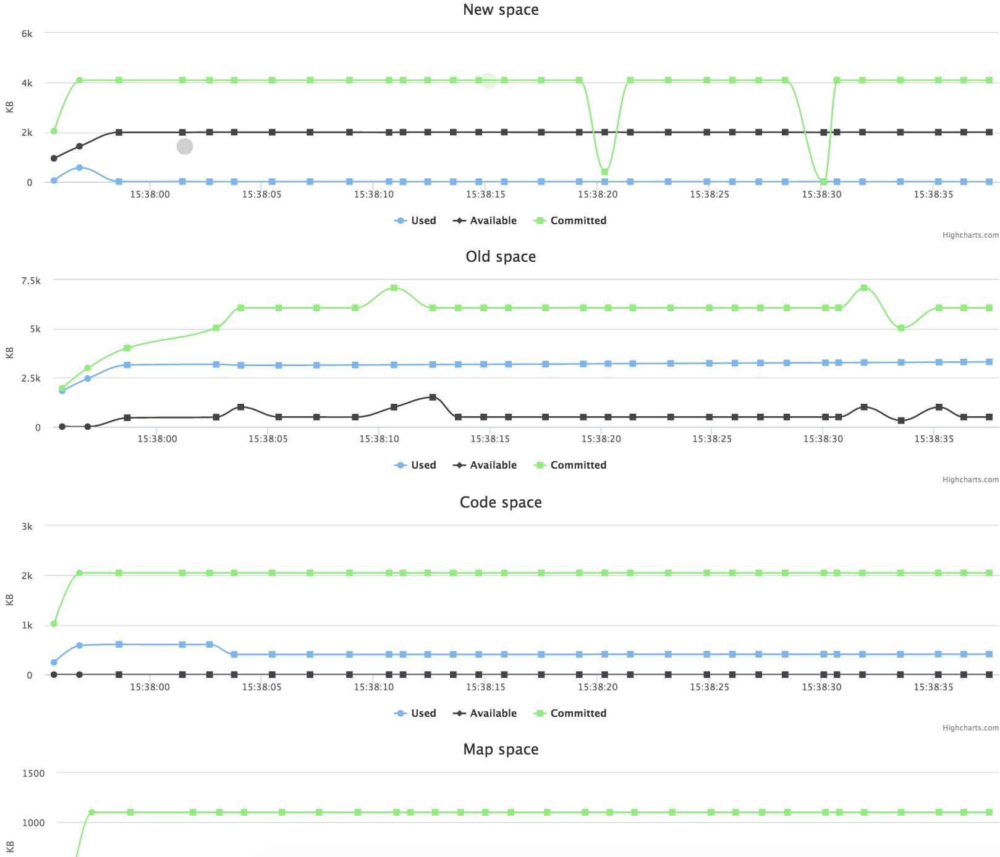

# Node GC viewer

Visualizes the usage of V8 heap spaces after every garbage collector run (both Scavenge and Mark-sweep).

## Install
```bash
  npm install node-gc-viewer -g
```

## Usage
```bash
  node-gc-viewer [node.js options] [ watched script.js ]

  Runs a garbage collector visualizer on localhost:9999 and opens its frontend in your default browser.

  To run backend on different domain or port, use env variables DOMAIN and/or PORT:
  DOMAIN=custom-domain PORT=9999 node-gc-viewer [node.js options] [ watched script.js ]

  To run a coffeescript file, try eg.:
  node-gc-viewer $(which coffee) script.coffee
```

## Sample usage
```bash
  node-gc-viewer --max_old_space_size=100 sample_script.js
```

## Sample visualization
